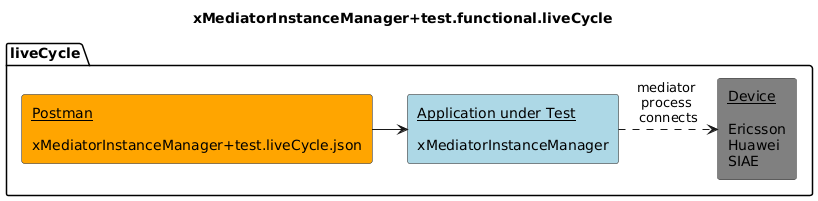
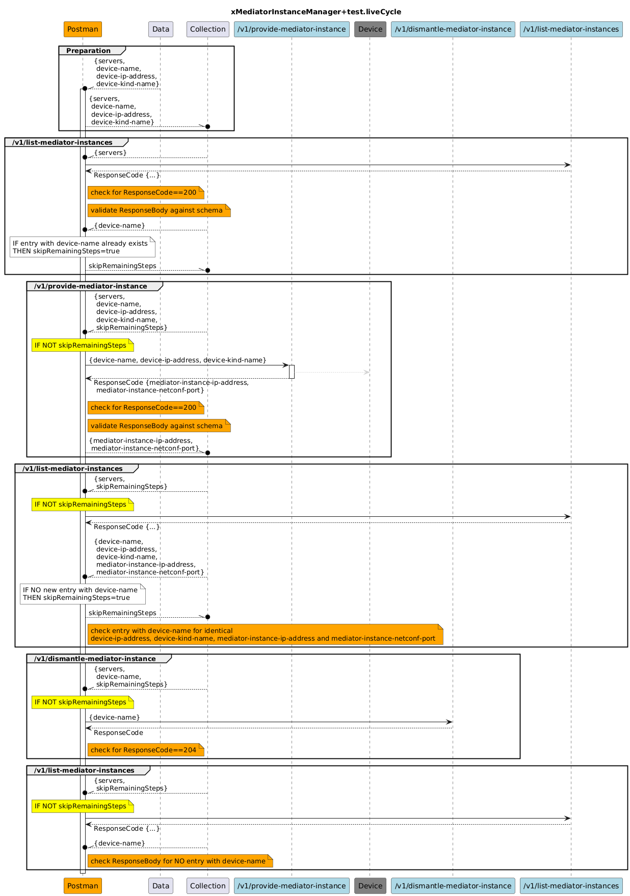

# Testing of liveCycle  

This testcase is for manual execution only.  
Sandbox cannot be automatically created as the SBI of the mediator is addressing devices via NETCONF.  

A physical device is required for executing this testcase.  
The values of the deviceName (~mountName), deviceIpAddress and deviceKindName attributes in the DATAfile must match to the applied physical device.  
After properly preparing the DATAfile, the testcase is creating, checking and deleting a mediator instance for that device.  

! To prevent harm from existing laboratory installations, testcase execution gets stopped, if the same deviceName identifies an already existing mediator.  

## Components  
  

## v0.0.2  
  
